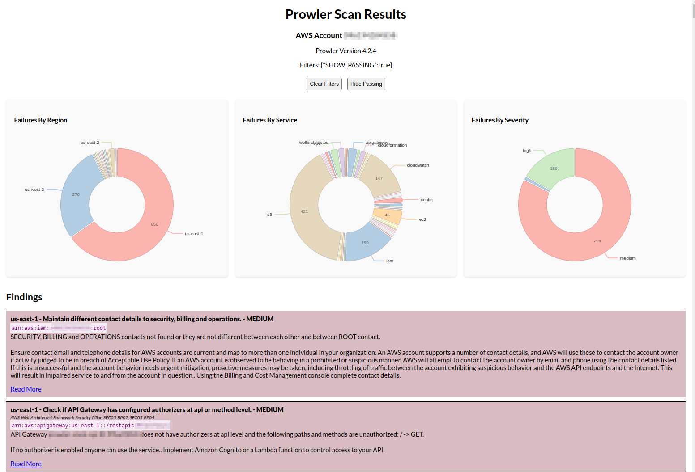

# prowler-ui

Small React app to take [Prowler](https://github.com/prowler-cloud/prowler) CSV data and render it in an appealing way with on a simple web page with some basic filtering since the HTML output is not appealing.



There are 2 parts to this app:

* React app (requires [npm](https://docs.npmjs.com/downloading-and-installing-node-js-and-npm) or [bun](https://bun.sh/))
* Python script (requires Python3 + python3-venv)

## Setup

Run a Prowler scan with `-M csv` and pass the output file location to the [compile_prowler_data.py](./compile_prowler_data.py) script.

```
./compile_prowler_data.py ~/Downloads/prowler_scan_20240712-0839.csv
```

The data gets placed into `./src/data` as:

* `metadata.json` (Prowler version and AWS account ID)
* `raw_data.json` (a list of all scan items sorted by STATUS)

From there run `npm run start` and you should see data at [localhost:3000](http://localhost:3000) or `npm run build` to build the static HTML.